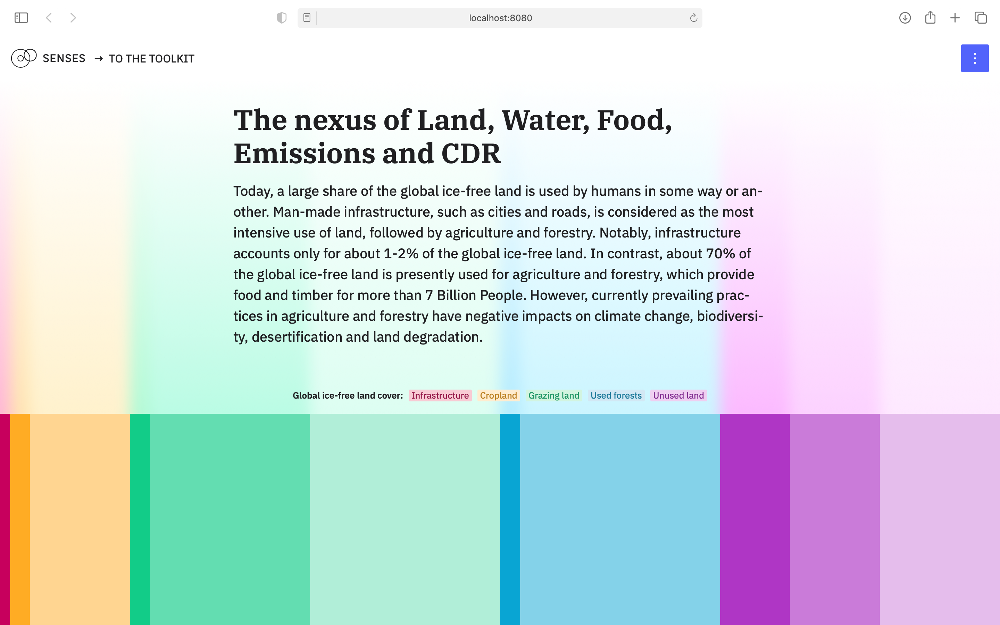

# The nexus of Land, Water, Food, Emissions and CDR

This repository contains the code for [*The nexus of Land, Water, Food, Emissions and CDR*](https://climatescenarios.org/land-use), a learn module on land use change and sustainable land management. It is part of the [SENSES Toolkit](https://climatescenarios.org/).



## License

The source code is licensed under the [ISC license](LICENSE.md). Text and graphics are licensed under [Attribution-ShareAlike 4.0 International](https://creativecommons.org/licenses/by-sa/4.0/). For licensing information on datasets please refer to the data sources section. Exceptions are listed below on a per-file basis.

## Data Soucres

Data sources and if applicable licenses are listed below on a per-file basis.

- `*/land-change.csv` `*/land-change-impacts.csv` `*/land-emissions.csv` `*/land-sustainable.csv`: [IAMC 1.5°C Scenario Explorer and Data hosted by IIASA](https://data.ene.iiasa.ac.at/iamc-1.5c-explorer/); [License for the IAMC 1.5°C scenario ensemble data](https://data.ene.iiasa.ac.at/iamc-1.5c-explorer/#/license)
- `*/land-pressure.csv` contains data from multiple sources:
    - population: [WDI](https://data.worldbank.org/indicator/SP.POP.TOTL); [CC BY-4.0](https://datacatalog.worldbank.org/public-licenses#cc-by)
    - income: [James](https://doi.org/10.1186/1478-7954-10-12)
    - calory supply, demand, yield: [FAOSTAT](http://www.fao.org/faostat/en/)
    - prices: [WBGEM](https://datacatalog.worldbank.org/dataset/global-economic-monitor); [CC BY–4.0](https://datacatalog.worldbank.org/public-licenses#cc-by)
    - household expenditure share: [based on FAO](https://github.com/pik-piam/mrvalidation)
    - land cover: Based on LUH2 and FAO
    - irrigation: [LUH2](https://luh.umd.edu)
    - fertilization: [Lassaletta2014](https://iopscience.iop.org/article/10.1088/1748-9326/9/10/105011/meta); [CC BY 3.0](https://creativecommons.org/licenses/by/3.0/)
    - emissions: [PRIMAPhist](https://doi.org/10.5880/PIK.2017.001); [CC BY-4.0](http://creativecommons.org/licenses/by/4.0/)
- `src/assets/data/land-cover.js` Source: [Shukla, P. R., Skea, J., Calvo Buendia, E., Masson-Delmotte, V., Pörtner, H. O., Roberts, D. C., ... & Ferrat, M. IPCC, 2019: Climate Change and Land: an IPCC special report on climate change, desertification, land degradation, sustainable land management, food security, and greenhouse gas fluxes in terrestrial ecosystems.](https://www.ipcc.ch/srccl/chapter/summary-for-policymakers/)
- `src/assets/data/land-net.csv` Source: [Smith, P. (2016), Soil carbon sequestration and biochar as negative emission technologies. Glob Change Biol, 22: 1315-1324. doi:10.1111/gcb.13178](https://onlinelibrary.wiley.com/doi/abs/10.1111/gcb.13178)

## Development

## Project setup
```
npm install
```

### Compiles and hot-reloads for development
```
npm run serve
```

### Compiles and minifies for production
```
npm run build
```

### Lints and fixes files
```
npm run lint
```
